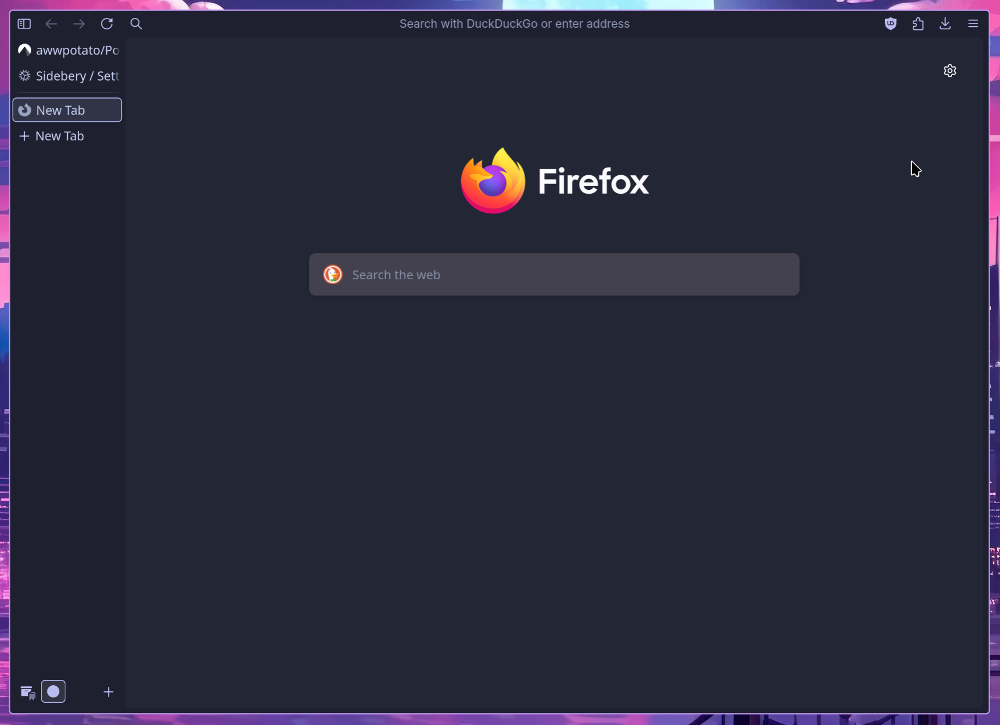
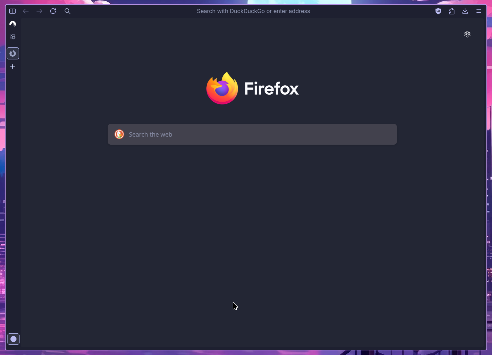
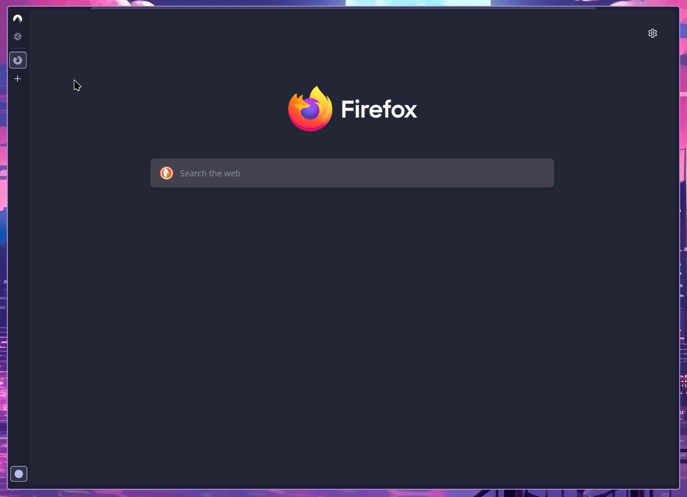
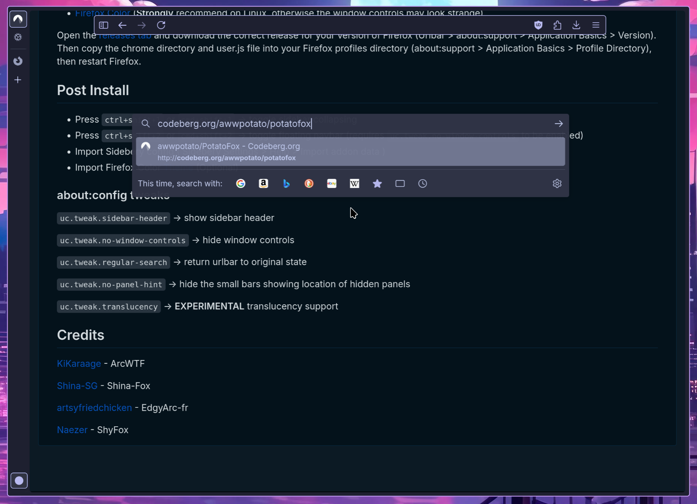

# PotatoFox

## Compatibility

Tested on Linux, MacOS, and Windows. 

## Features

- collapsing vertical tabs using Sidebery 
- pop-up arc-like urlbar
- option to hide the navbar for a ultra-minimal experience 
- general visual enhancements  
- custom SVG icons for some extensions
- support for vertical tabs on the left or right

## Screenshots

## Install Instructions

Required Extension:

* [Sidebery](https://addons.mozilla.org/en-US/firefox/addon/sidebery)
* [Userchrome Toggle Extended](https://addons.mozilla.org/en-US/firefox/addon/userchrome-toggle-extended)
* [Firefox Color](https://addons.mozilla.org/en-US/firefox/addon/firefox-color) (optional)

Open the [releases tab](https://codeberg.org/awwpotato/PotatoFox/releases) and download the correct release for your version of Firefox (Urlbar > about:support > Application Basics > Version). Then copy the chrome directory and user.js file into your Firefox profiles directory (about:support > Application Basics > Profile Directory), then restart Firefox.

## Post Install

- Press `ctrl+shift+1` or `cmd+shift+1` -> toggle sidebar collapsing
- Press `ctrl+shift+2` or `cmd+shift+2` -> toggle floating navbar 
- Import Sidebery config (Sidebery Settings > Help > Import addon data)
- Import Firefox Color [Theme](https://color.firefox.com/?theme=XQAAAAJIBAAAAAAAAABBqYhm849SCicxcUcPX38oKRicm6da8pG5gi-DrbS7fiEFLUzDsWXWyUHMSkHZ2PpRK_LvZGTF44fp7VnVXujpkKMjvOWQSIhdK22u1ZG2EgdMyNMx_0oKJ3H9Aulj_W-sLqp3C7P9xxbnSMyQXGvfNmFAc8Mw6b7sZVymuhR0izERZjptFUVqlI0Zglmvbx7Aqqf1yCNtF2ljYjJBJ2zeQ3SGqmjknTFkU7hkVMy3aRrVafVheQXSAb6urDunQ8LZD2shNDvg5bN-ozZG255xn3hB1gfB1yVOKWNg9jJYn6DntzqTwzgEmwpEgPB4NyBczypZzFqtS5oB-cT0e_lH4lrI8tO01TfXk0UUp6n29KfQU8nu5zesYpVUZThdOvZPqE6CpFbMooJ1cL6fU-TdtOGpTkrgd2fzHgwJX6a54v0tN0aHaAQD3jj-0fqNVcm4Lg-8eyxZ09ItqMLD48JaDU9OFPtiCyyvpsoYYfuZf9osapMO72ZS-AfpMq9oF6ZHatA6Xvt7B8-XGebHGtdzq0PHgpkZPu-zwq2PPoCCFGzjkUZVjpBGQm7UXoevFP_2oiQt) (Optional)
- about:addons (url) > Userchrome Toggle Extended preferences > General settings > allow multiple styles to be active together, apply changes 

### about:config tweaks

`uc.tweak.sidebar-header` -> show sidebar header

`uc.tweak.sidebar-full-collapse` -> make sidebar fully hidden when collapse (like the hidden navbar)

`sidebar.position_start` -> whether the sidebar is on the left or right

`uc.tweak.no-window-controls` -> hide window controls

`uc.tweak.regular-search` -> return urlbar to original state

`uc.tweak.no-panel-hint` -> hide the small bars showing location of hidden panels

`uc.tweak.translucency` -> **EXPERIMENTAL** translucency support

`browser.tabs.allow_transparent_browser` -> allow tab contents to have transparent bg (requires `uc.tweak.translucency`)

## Credits

[KiKaraage](https://github.com/KiKaraage/ArcWTF) - ArcWTF

[Shina-SG](https://github.com/Shina-SG/Shina-Fox) - Shina-Fox

[artsyfriedchicken](https://github.com/artsyfriedchicken/EdgyArc-fr) - EdgyArc-fr

[Naezer](https://github.com/Naezr/ShyFox) - ShyFox
