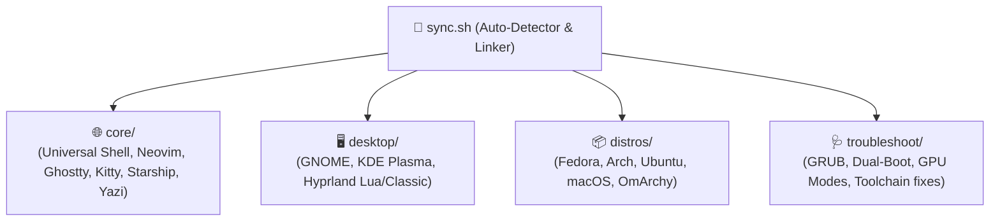

# 🚀 archConfig

[](file:///home/codesmith28/archConfig)
[](file:///home/codesmith28/archConfig/desktop)
[-green?logo=neovim&logoColor=white)](file:///home/codesmith28/archConfig/core/config/nvim)
[](file:///home/codesmith28/archConfig/core/config)

A unified, modular, cross-distribution dotfiles and bootstrap system. Designed to deliver an identical, high-performance developer workflow across **Fedora**, **Arch Linux**, **Ubuntu**, **macOS**, and **OmArchy** without configuration fragmentation.

---

## 🏗️ Layered Architecture

The repository separates universal developer tooling from desktop environments, distro-specific package installers, and troubleshooting runbooks:



| Layer | Directory | Purpose |
| :--- | :--- | :--- |
| **Core Configs** | [`core/config/`](file:///home/codesmith28/archConfig/core/config) | Universal application configurations (`nvim`, `ghostty`, `kitty`, `starship.toml`, `yazi`, `fastfetch`, `fontconfig`, `tmux`). |
| **Core Home** | [`core/home/`](file:///home/codesmith28/archConfig/core/home) | Universal shell dotfiles (`.bashrc`, `.bashrc.d/`, `.bash_profile`, `.profile`, `.zshrc`, `.inputrc`, `.vimrc`, `.tmux.conf`). |
| **Desktop Layer** | [`desktop/`](file:///home/codesmith28/archConfig/desktop) | Modular DE configs: GNOME extensions/dconf, KDE Plasma shortcuts, and Hyprland (Lua & classic). |
| **Distro Layer** | [`distros/`](file:///home/codesmith28/archConfig/distros) | Package installation scripts, systemd unit files, and hardware optimizations per distribution. |
| **Troubleshooting** | [`troubleshoot/`](file:///home/codesmith28/archConfig/troubleshoot) | Centralized runbooks and scripts for bootloader recovery, GPU switching, and compiler quirks. |
| **AI Skills** | [`.agents/skills/`](file:///home/codesmith28/archConfig/.agents/skills) | Rules for AI agents (`archconfig-guard`) to guarantee zero cross-distro breakage and maintain docs. |

---

## ⚡ Quick Start

### 1. Clone the repository
```bash
git clone https://github.com/Codesmith28/archConfig.git ~/archConfig
cd ~/archConfig
```

### 2. Synchronize dotfiles
The root synchronizer automatically detects your operating system and desktop environment:

```bash
# Preview symlink actions (safe dry-run)
./sync.sh --dry-run

# Apply symlinks
./sync.sh
```

#### Manual Overrides
You can explicitly override detection when setting up a specific environment:
```bash
# Fedora with GNOME
./sync.sh --distro fedora --de gnome

# Arch with Hyprland
./sync.sh --distro arch --de hyprland

# macOS Workstation
./sync.sh --distro mac --de none
```

---

## 🛠️ Toolchains & Developer Features

### Dynamic Compiler Discovery (C++23)
No more hardcoded compiler names or version mismatches between Homebrew and Linux package managers:
- Dynamically discovers the newest installed GCC/G++ (`gcc-17` down to unversioned `gcc`/`g++`).
- Automatically exports `$CC`, `$CXX`, and provides modern C++ runner helper:
  ```bash
  run_cpp solution.cpp    # Compiles with -std=c++23 -O2 -Wall using newest available g++
  ```
- Neovim's `clangd` LSP and `assistant.lua` (competitive programming runner) dynamically detect compiler versions and system include paths across platforms.

### Neovim Setup (`core/config/nvim`)
- **Base**: Modern LazyVim distribution.
- **Python**: Integrated with `pyrefly` fast type-checker and language server.
- **Java**: Automatic `resolve_java_home()` supporting macOS Homebrew, Fedora, Arch, and Ubuntu JDK installations.
- **C/C++**: Clangd configured with universal query-driver for complete standard library intellisense.
- **Competitive Programming**: Integrated test-case assistant with hotkeys for fast problem verification.

---

## 📦 Distribution Bootstrapping

When setting up a fresh machine, run the setup scripts inside [`distros/`](file:///home/codesmith28/archConfig/distros):

### Fedora Workstation
```bash
cd distros/fedora
# Install core packages, RPM Fusion, and developer tools
bash setup_scripts/setup.sh
```

### Arch Linux (KDE or Hyprland)
```bash
# Black box automated setup
cd distros/arch/black_box
bash main.sh
```

### Ubuntu (Desktop or Server)
```bash
cd distros/ubuntu
bash setup.sh
```

### macOS (Darwin)
```bash
cd distros/mac
# Install Homebrew formulas and casks
brew bundle --file=Brewfile
```

---

## 🩺 Troubleshooting Runbooks

Common hardware and dual-boot solutions are documented in [`troubleshoot/`](file:///home/codesmith28/archConfig/troubleshoot):

- **[Restoring GRUB Bootloader](file:///home/codesmith28/archConfig/troubleshoot/restore_grub.md)**: Reinstalling EFI entries after Windows updates or BIOS resets; fixing missing Windows dual-boot entries with `os-prober`.
- **[Automated GRUB Repair Script](file:///home/codesmith28/archConfig/troubleshoot/restoreGrub.sh)**: Single-command script to reinstall GRUB on UEFI systems.
- **[Fixing `<bits/stdc++.h>` on macOS](file:///home/codesmith28/archConfig/troubleshoot/fix_bits_stdcxx_macos.md)**: Resolving missing C++ bits headers on Darwin systems.

---

## 🤖 AI Assistant Guidelines

This repository includes an Antigravity Agent Skill in [`.agents/skills/archconfig-guard`](file:///home/codesmith28/archConfig/.agents/skills/archconfig-guard). When using AI coding assistants in this repo:
1. **Never hardcode compiler versions or platform-exclusive commands** in `core/`.
2. **Never break existing symlinks** on live systems; use backward-compatible shims when refactoring paths.
3. **Always document new solutions** in [`troubleshoot/`](file:///home/codesmith28/archConfig/troubleshoot) whenever resolving a platform-specific bug.

For detailed migration history and architectural rationale, consult [MIGRATION.md](file:///home/codesmith28/archConfig/MIGRATION.md).
