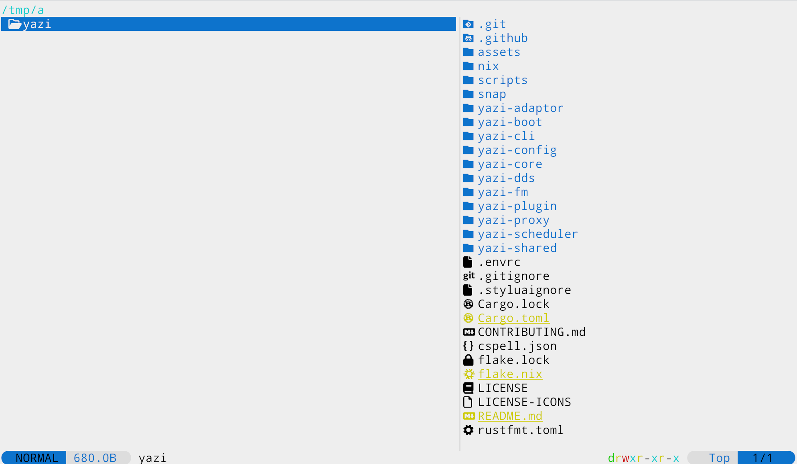
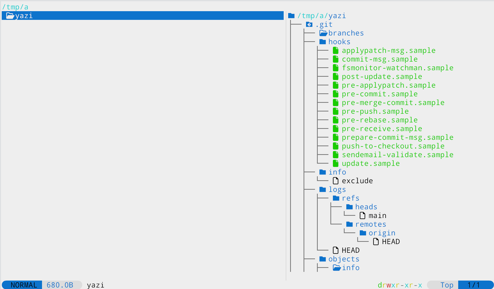

# eza-preview.yazi

[Yazi](https://github.com/sxyazi/yazi) plugin to preview directories using [eza](https://github.com/eza-community/eza), can be switched between list and tree modes.

List mode:


Tree mode:


## Requirements

- [yazi](https://github.com/sxyazi/yazi)
- [eza](https://github.com/eza-community/eza)

## Installation

### Linux/MacOS

```sh
git clone https://github.com/sharklasers996/eza-preview.yazi ~/.config/yazi/plugins/eza-preview.yazi
```

## Usage

Add `eza-preview` to previewers in `yazi.toml`:

```toml
prepend_previewers = [
	{ name = "*/", run = "eza-preview" },
]
```

Set key binding to switch between list and tree modes in `keymap.toml`:

```toml
[manager]
keymap = [
	{ on = [ "E" ], run = "plugin eza-preview",  desc = "Toggle tree/list dir preview" },
]
```

List mode is the default, if you want to have tree mode instead when starting yazi - update `yazi.lua` with:

```lua
require("eza-preview"):setup()
```
